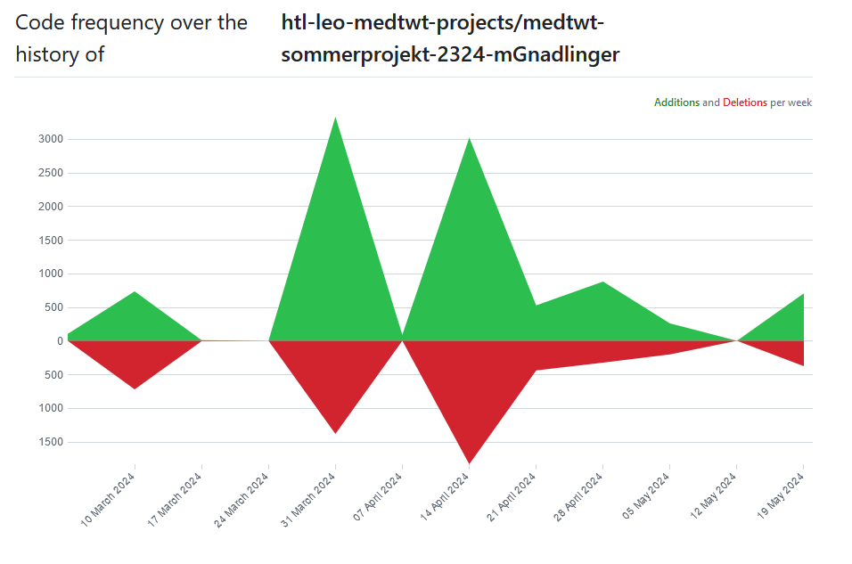

# Sprint Dokumentation 

## Sommersemesterprojekt 2023/24
Miriam Gnadlinger 2AHITM  
GetHealthy -> [Link zu meinem GitHub-Repo](https://github.com/htl-leo-medtwt-projects/medtwt-sommerprojekt-2324-mGnadlinger/ "Link zu meinem GitHub-Repo")

### Sprint #01 

#### Neuerungen 
-   Bilder für die Trainings und Rezepte herausgesucht 
-   Für Rezepte, Trainingspläne und Tipps Content herausgesucht und diese in einem JSON Objekt abgespeichert 

#### Ziele bis zum nächsten Sprint 

-   Grundgerüst meiner Website (erstellen aller HTML seiten)
-   Gestalten der Startseite

#### Commit Insight

### Sprint #02

#### Neuerungen
-   Grundgerüst meiner Website 
-   Alle HTML Seiten, grundsätzliches Styling und bereits einiges der Content Generierung
-   Grundlegendes Styling der Website (Kleine Anpassungen kommen noch)

#### Ziele bis zum nächsten Sprint

-   Die Content Generierung mit JS auf alle Seiten (Detail-Ansichten der Rezepte und Trainings)
-   JS Programmierung der Trainings (Training starten) 
-   JS und HTML für die Anmeldung bzw. Account erstellen 

#### Github Insights 
##### Commit Insight

##### Code Frequency

### Sprint #03

#### Neuerungen
-   Content zu den Detail Ansichten der Rezepte und Trainings 
-   Rezept Detail Ansicht mit verändern der Mengen bei mehr Portionen 
-   Speichern von Rezepten und Tipps 

#### Ziele bis zum nächsten Sprint

-   Styling (die paar Kleinigkeiten die noch fehlen)
-   JS und HTML für die Anmeldung bzw. Account erstellen
-   Erreichen der Wochenziele 

#### Github Insights
##### Commit Insight

##### Code Frequency

### Sprint #04

#### Neuerungen
-   Styling (die paar Kleinigkeiten die noch fehlen)
-   JS und HTML für die Anmeldung bzw. Account erstellen

#### Ziele bis zum nächsten Sprint

-   Erreichen der Wochenziele
-   Kleine Details verbessern
-   Testen und Ausprobieren (Fehlermeldungen/Sonderfälle einbauen)

#### Github Insights
##### Commit Insight

##### Code Frequency

### Sprint #05

#### Neuerungen
-   Erstellen eines Wochenplans 
-   Erstellen eines Accounts und Speichern der Daten
-   Verbesserungen an kleinen Stellen 

#### Ziele bis zum nächsten Sprint

-   Erreichen der Wochenziele fertigstellen (Fehler/Styling ausbessern)
-   Kleine Details verbessern
-   Testen und Ausprobieren (Fehlermeldungen/Sonderfälle einbauen)

#### Github Insights
##### Commit Insight

##### Code Frequency

